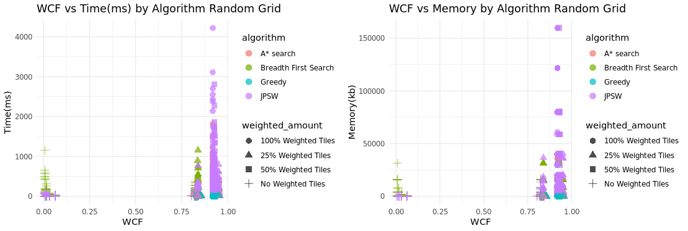
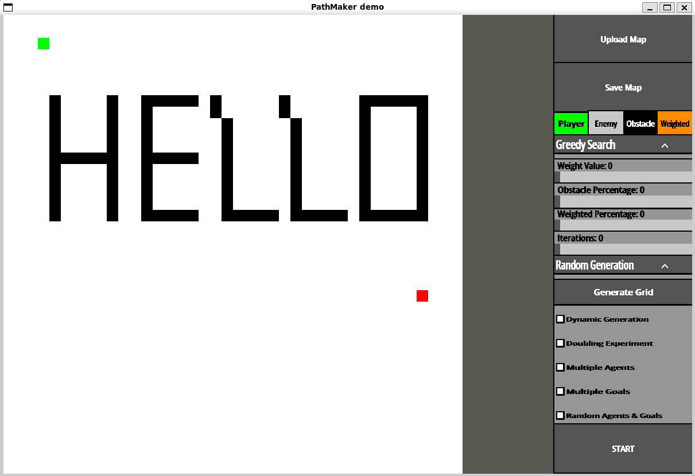
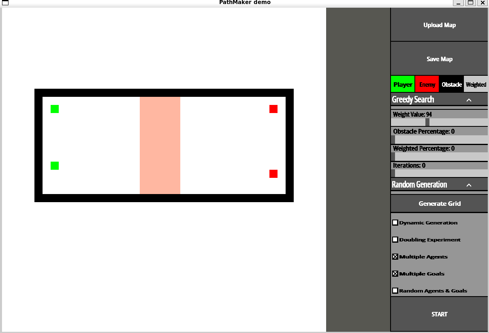

# Experiments

This chapter describes your experimental set up and evaluation. It should also
produce and describe the results of your study. The section titles below offer
a typical st
## Experimental Design


### Grid Configurations

To analyze *PathMaker*'s ability to run different environments and different types of grids and get an accurate result. I set up a function with the following Parameters in order to generate different configurations to run experiments on.

Table 1: Configuration Parameters

Variable|Description|Possible Values|
|:----|:----|:----|
|Grid Size|Determines the overall grid size and total amount of tiles| 64,128,256,512|
|Obstacle %|The percentage of the grid that is obstacles| 0,25,50|
|Weighted %|The percentage of the grid that has weighted tiles| 0,25,50,100|
|Range of Weights|The range of weights a weighted tile can be generate with| 1,10,100,255|


I then take all the possible different combinations of these bundling Weighted % and Range of Weights together as they are directly related, to get a total of 196 different possible configurations to generate. As for the chosen values of these variables Grid size maxes at 512 because often benchmarks on pathfinding algorithms are on a 512 * 512 grid and any higher would make the experiments take possibly hours to days, the lower values I simply implemented doubling experiment so decreasing by half each time to get a good idea of how things change at different sizes. Obstacle percentage maxes out at 50% and is also set up as a doubling experiment as the program doesn't allow above 50% as mentioned previously in order to limit the amount of impossible grids generated. Weighted percentage goes up to 100% and set up like a doubling experiment again as weighted tiles have no affect on the possibility of a grid they can go up to 100%. The weight range however starts at the minimum possible values and has 255 as the max as that is the highest a weight can get, 10 and 100 are not doubling experiments but I chose them to help get a better idea of what a low weight range that isn't one and a high that isn't the max and how it affects the grid generation. I would do more values but as stated this can increase the time the program takes drastically and I believe these to be enough to get a good understanding of the program. Outside of these configurations there is also two different grid types that were generated for these experiments


Table: Grid types

|Type|Description|Parameters for Generation|
|:----|:----|:----|
|Random|Completely randomized grid with not set rules for how it should be generated|Grid size, Obstacle %, Weighted%, Weight Range|
|City|Generates a manhattan style city with roads and buildings as stand ins for obstacles|Grid Size, Max road spacing, Building Density, Max building size|

This is to help better represent real life scenarios a pathfinding algorithm may be used in to see how *PathMaker*s benchmarks perform and if they are accurate giving different types of grids.

After getting all the configurations and generating a grid I ran every built in algorithm to *PathMaker* on each grid generated 10 times, this is to get a good average of there performance as performance can very depending on circumstances and isn't a constant. I did this for both city and random grids and had the results stored in a large csv file that stores the parameters and the memory,time,WCF, steps taken and overall path cost for each time an algorithm was run and successful an example of which can be seen below. If a grid was generated that deemed to be impossible or an algorithm wasn't able to complete the task in a reasonable amount of time then that run was omitted from the results. As for analyzing and evaluating the data this was done by graphing the results in R.

```csv
algorithm,grid_size,obstacle_pct,weighted_pct,weight_range,run,wcf,memory_bytes,time_ms,steps,path_cost
A* search,64,0,25,10,0,0.496161,327656,13.5531,1405,510
Breadth First Search,64,0,25,10,0,0.496161,8200,6.3206,58,765
```

### Test Cases and Coverage

As for running experiments on how the *PathMaker* itself runs and how well it is tested and how well users can create there own maps and can run benchmarks. The best way to do that outside of having people use the tool is test cases and seeing how well those tests encapsulate the entirety of the code base. For this I created multiple test cases for *PathMaker* and used the llvm-cov crate to track the code coverage and to run tests to see if anything fails. I can't test 100% of the code base as it relies on key inputs and requires SDL2 to handle that making it very difficult to actually test parts of the code that rely on it, I can however test the backend to help make sure that things work as intended when interacted with on the backend level. As well as provide examples to prove that features work.


**Algorithm Testing:**

Table: Pathfinding Test Suite

| Category | Tests | What is Verified |
|----------|-------|------------------|
| Movement | 5 | get_possible_moves handles open grids, corners, obstacles, and corner-cutting prevention |
| Weight Calculation | 3 | Path weight computation with uniform and weighted tiles |
| Algorithm Factory | 5 | get_algorithm returns correct implementations by name |
| BFS | 4 | Shortest path correctness, edge cases (start=goal, blocked grids) |
| A* | 4 | Optimal path finding, weight-aware navigation |
| Greedy | 2 | Heuristic-driven search, failure on impossible paths |
| JPSW | 8 | Jump point detection, path reconstruction, move cost calculation, caching |
| Agent | 4 | Goal detection, bidirectional path existence checking |
| Cross-Algorithm | 4 | All algorithms agree on reachability; maze scenarios |

**Correctness Criteria:**

Each pathfinding test verifies that returned paths:
1. Start at the specified start position
2. End at the specified goal position
3. Contain only adjacent traversable tiles
4. Never revisit previously visited nodes

To ensure correctness, algorithms where also compared to each other on an empty grid with a straight to make sure they all agree that a path is possible and find a path in a reasonable amount of time. This helps makes sure the algorithms can reach known possible paths given a simple grid in the case of greedy as a result of it being able to get stuck.


**Board Module Tests:**

The board module contains 29 test cases covering tile behavior, grid generation, serialization, and component interaction:

Table: Game Board Test Suite

| Category | Tests | What is Verified |
|----------|-------|------------------|
| Tile | 14 | Position scaling, traversability for all tile types, dirty flag behavior, rectangle calculation |
| TileType | 3 | Equality comparisons, serialization roundtrip for all variants including Weighted |
| Board Core | 10 | Tile dimension calculations, grid creation and caching, component active state, mouse detection |
| Serialization | 3 | JSON save/load preserves dimensions, starts, goals, and grid structure |
| Grid Generation | 4 | Random grid creates obstacles, city generation handles agents, cache population |
| File I/O | 1 | Board saves to file and file is created at expected location |

Each tile test verifies that position scaling works correctly (grid coordinates multiplied by tile dimensions) and that all non-obstacle tile types are traversable. The serialization tests confirm that boards can be saved to JSON and loaded back with all metadata intact, including start/goal positions and grid dimensions.

The grid generation tests verify that random and city-style maps are created according to specified parameters, with obstacles appearing at the expected frequencies. File I/O tests confirm that the save functionality writes valid JSON files that can be read back without data loss.

## Evaluation


### Overall Avg for Different Grids

\begin{figure}[h!]
  \centering
  \includegraphics{./images/Comp_Average_Random.png}
  \caption{Random Grid Averages}
  \label{fig:rg_avg}
\end{figure}   

\begin{figure}[h!]
  \centering
  \includegraphics{./images/Comp_Averages.png}
  \caption{City Grid Averages}
  \label{fig:cg_avg}
\end{figure}   


You can see on average A* has the lowest path cost, greedy is the most efficient when it comes to memory and speed, while JPSW has on average the highest memory cost. This is all to be expected and it's important to take into account that *greedy* and *breadth first search* don't account for weighted tiles like *A** and *JPSW* making them have significantly less calculations to worry about and they not worrying about path cost simply finding a path. Based on the results you may think that greedy is a great option for a lot of cases which is true but it's also important to keep in mind that greedy has a higher failure rate then the rest and was unable to complete as many grids as the other algorithms.

All of these are all features that are known about these algorithms and are important when considering when making a decision. But what does this actually say about *PathMaker*, Based on the paper introducing *JPSW*, JPSW is slower then A* without using full caching and extensive pruning [@OPFW].So the result of it being slower while also finding comparable path costs is to be expected unless *PathMaker* were to implement heavier caching and pruning which would increase the already high memory cost of JPSW. 

### Time and Memory Comparisons when taken WCF into account

\begin{figure}[h!]
  \centering
  \includegraphics{./images/WCF_TM_PLOTs.png}
  \caption{WCF plots City and Random}
  \label{fig:wcf_tm}
\end{figure}  

Another goal of *PathMaker* is to be able to generate a wide array grids with varying complexities and to be able to compare algorithms based on grid complexity. Based on these plots of the data collected by *PathMaker* It can be used to make comparisons between algorithms is there and effective however the ability to generate grids of varying complexity is questionable especially when looking at randomized grids they are either a very low complexity or high complexity and almost no grids were generated 




To take a closer look at what type of situations the algorithms preform better in, I tracked the wcf value with the amounted of weighted tiles and obstacle tiles and compared what often had the highest completion time and memory usage. Overall *JPSW* had the highest completion time and memory usage. Based on the results this occurs with a large amount of weighted tiles and minimal obstacles. This is to be expected and is a known downside of *JPSW* if there are constant changes in weights between tiles then it's main advantage being able to jump over multiple points is never used because it changes the direction it jumps when running into a different weighted tile.

### Testing and Coverage

*PathMaker*'s correctness was verified through a comprehensive unit test suite implemented directly in Rust. The `llvm-cov` tool was used to measure code coverage during test execution. The coverage report is shown below

#### General Results

Table: Code Coverage and Testing Results

| Filename                   | Regions | Missed Regions | Cover   |
|----------------------------|---------|----------------|---------|
| benchmarks.rs              | 696     | 170            | 75.57%  |
| cmp/board.rs        | 1710    | 490            | 71.35%  | 
| cmp/button.rs       | 2588    | 905            | 65.03%  | 
| cmp/file_explorer.rs| 624     | 198            | 68.27%  |
| cmp/inputbox.rs     | 451     | 152            | 66.30%  | 
| cmp/widget.rs       | 821     | 233            | 71.62%  |
| fileDialog.rs              | 398     | 55             | 86.18%  |
| main.rs                    | 2284    | 1313          | 42.51%  | 
| pathfinding.rs             | 1982    | 106            | 94.65%  |
| settings.rs                | 214     | 15             | 92.99%  |
| util.rs                    | 370     | 1              | 99.73%  |
| **TOTAL**                  | **12138**| **3638**      | **70.03%**|

\begin{figure}[h!]
  \centering
  \caption{Code Coverage and Test Results}
  \label{fig:table_coverage}
\end{figure} 

Overall the total coverage from unit testing is 70.03% covered. Coverage being how much of the code has been tested not how many of the tests passed. The components all hover around 70% covered as they also heavily rely on mouse clicks and buttons presses.

**Test Results**

\begin{figure}[h!]
  \centering
  \includegraphics{./images/Test_R_Comp.png}
  \caption{Test Results}
  \label{fig:t_results}
\end{figure}   

As for the actual tests themselves *PathMaker* Passes 358/358 of them showing that most if not all of the backend is working as intended as far as the tests can tell.

### User Created Maps

For testing created maps and showing results there are test cases for this but as this is mostly a visual feature it's likely better to create some and show those created maps below using the PathMaker tool.




## Threats to Validity

### Reliance on Crates and C-Libraries

As with most tools *PathMaker* relies on rust crates and the SDL2 C-libraries while the rust crate for SDL2 is actively being worked on and maintained SDL2 itself is no longer being maintained and they have moved on to SDL3. This isn't a huge issue for PathMaker as while the UI is important there are many things that can replace SDL2 if it ever becomes unusable such as SDL3 or possibly as rust base graphics library.

### Changes to Operating System

OS updates also pose a threat to *PathMaker* as libraries may be deprecated for example if Mac stops using HarfBuzz and it becomes deprecated on new Mac systems this will immediately break *Pathmaker* for MacOs because SDL2_TTF relies on HarfBuzz for font implementation. Most of this can be avoided by static linking every dependency for *Pathmaker* so users don't need to install outside libraries to run it. But if a library that is natively installed on a OS that PathMaker relies on is removed or deprecated this would cause problems and would have to be manually installed by the user.

### Unable to upload maps directly from other tools

While *PathMaker* allow users to create, save and upload maps created within the tool. If someone has a map created in something like a game engine they can't currently upload the map to *Pathmaker* without manually drawing it out on the board. Making it difficult to test already created maps and making it a chore to make new ones.

### Flaws with PathMaker

Threats to validity are related to the generated nature of maps for the experiments as while there's an attempt to have as much control as possible over what is generated while keeping it relatively random. It's still not perfect and could make testing algorithms and making sure there implemented correctly more difficult then using set grids. But based on the results of the running many different scenarios the results of the algorithm are consistent with how there expected to preform leaving me with confidence that they are correctly implemented. 