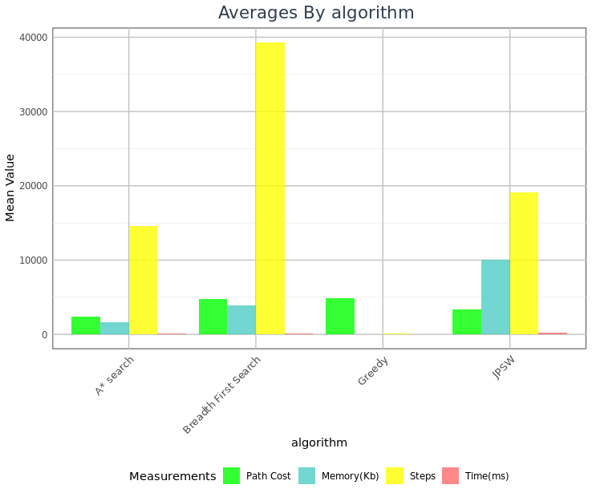
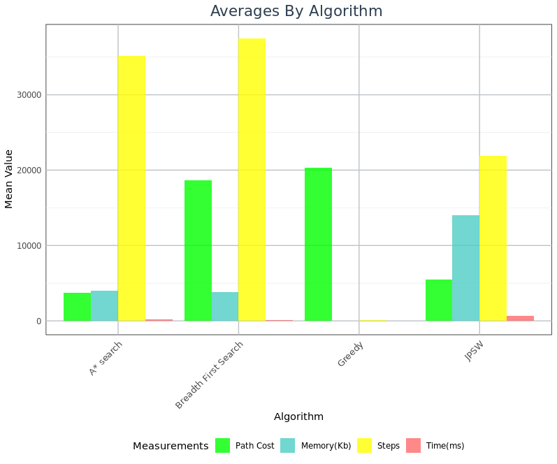
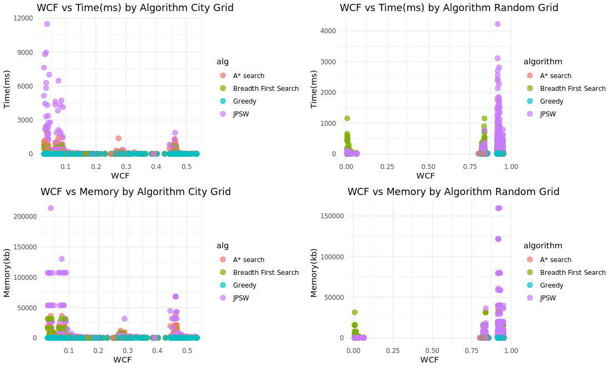
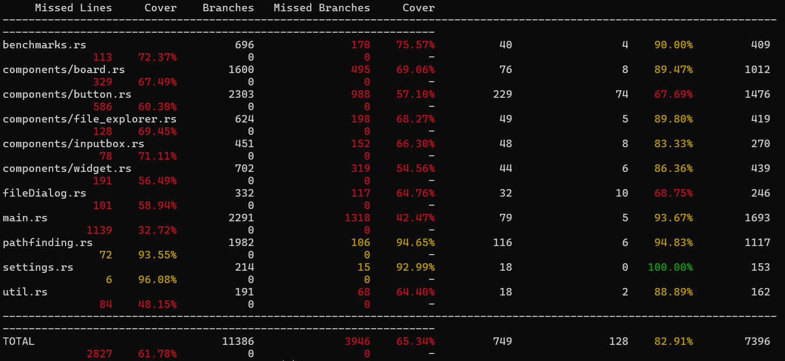

# Experiments

This chapter describes your experimental set up and evaluation. It should also
produce and describe the results of your study. The section titles below offer
a typical st
## Experimental Design

### Grid Configurations

To analyze PathMaker's ability to run different environments and different types of grids and get an accurate result. I set up a function with the following Parameters in order to generate different configurations to run experiments on.

Table: Configuration Parameters

Variable|Description|Possible Values|
|:----|:----|:----|
|Grid Size|Determines the overall grid size and total amount of tiles| 64,128,256,512|
|Obstacle %|The percentage of the grid that is obstacles| 0,25,50|
|Weighted %|The percentage of the grid that has weighted tiles| 0,25,50,100|
|Range of Weights|The range of weights a weighted tile can be generate with| 1,10,100,255|

I then take all the possible different combinations of these bundling Weighted % and Range of Weights together as they are directly related, to get a total of 196 different possible configurations to generate. As for the chosen values of these variables Grid size maxes at 512 because often benchmarks on pathfinding algorithms are on a 512 * 512 grid and any higher would make the experiments take possibly hours to days, the lower values I simply implemented doubling experiment so decreasing by half each time to get a good idea of how things change at different sizes. Obstacle percentage maxes out at 50% and is also set up as a doubling experiment as the program doesn't allow above 50% as mentioned previously in order to limit the amount of impossible grids generated. Weighted percentage goes up to 100% and set up like a doubling experiment again as weighted tiles have no affect on the possibility of a grid they can go up to 100%. The weight range however starts at the minimum possible values and has 255 as the max as that is the highest a weight can get, 10 and 100 are not doubling experiments but I chose them to help get a better idea of what a low weight range that isn't one and a high that isn't the max and how it affects the grid generation. I would do more values but as stated this can increase the time the program takes drastically and I believe these to be enough to get a good understanding of the program. Outside of these configurations there is also two different grid types that were generated for these experiments

Table: Grid types

|Type|Description|Parameters for Generation|
|:----|:----|:----|
|Random|Completely randomized grid with not set rules for how it should be generated|Grid size, Obstacle %, Weighted%, Weight Range|
|City|Generates a manhattan style city with roads and buildings as stand ins for obstacles|Grid Size, Max road spacing, Building Density, Max building size|

This is to help better represent real life scenarios a pathfinding algorithm may be used in to see how PathMakers benchmarks perform and if they are accurate giving different types of grids.

After getting all the configurations and generating a grid I ran every built in algorithm to pathmaker on each grid generated 10 times, this is to get a good average of there performance as performance can very depending on circumstances and isn't a constant. I did this for both city and random grids and had the results stored in a large csv file that stores the parameters and the memory,time,WCF, steps taken and overall path cost for each time an algorithm was run and successful. If a grid was generated that deemed to be impossible or an algorithm wasn't able to complete the task in a reasonable amount of time then that run was omitted from the results. As for analyzing and evaluating the data this was done by graphing the results in R.

### Test Cases and Coverage

As for running experiments on how the Pathmaker itself runs and how well it is tested and how well users can create there own maps and can run benchmarks. The best way to do that outside of having people use the tool is test cases and seeing how well those tests encapsulate the entirety of the code base. For this I created multiple test cases for Pathmaker and used the llvm-cov crate to track the code coverage and to run tests to see if anything fails. I can't test 100% of the code base as it relies on key inputs and requires SDL2 to handle that making it very difficult to actually test parts of the code that rely on it, I can however test the backend to help make sure that things work as intended when interacted with on the backend level. As well as provide examples to prove that features work. 

## Evaluation

### Overall Avg for Different Grids

**Random:**

**City:**

You can see on average A* has the lowest path cost, greedy is the most efficient when it comes to memory and speed, while JPSW has on average the highest memory cost. This is all to be expected and it's important to take into account that *greedy* and *breadth first search* don't account for weighted tiles like *A** and *JPSW* making them have significantly less calculations to worry about and they not worrying about path cost simply finding a path. Based on the results you may think that greedy is a great option for a lot of cases which is true but it's also important to keep in mind that greedy has a higher failure rate then the rest and was unable to complete as many grids as the other algorithms.

All of these are all features that are known about these algorithms and are important when considering when making a decision. But what does this actually say about Pathmaker, Based on the paper introducing *JPSW*, JPSW is slower then A* without using full caching and extensive pruning [@OPFW].So the result of it being slower while also finding comparable path costs is to be expected unless Pathmaker were to implement heavier caching and pruning which would increase the already high memory cost of JPSW. 

### Time and Memory Comparisons when taken WCF into account

Another goal of Pathmaker is to be able to generate a wide array grids with varying complexities and to be able to compare algorithms based on grid complexity. Based on these plots of the data collected by Pathmaker It can be used to make comparisons between algorithms is there and effective however the ability to generate grids of varying complexity is questionable especially when looking at randomized grids they are either a very low complexity or high complexity and almost no grids were generated 

### Testing and Coverage

### User Created Maps

## Threats to Validity
