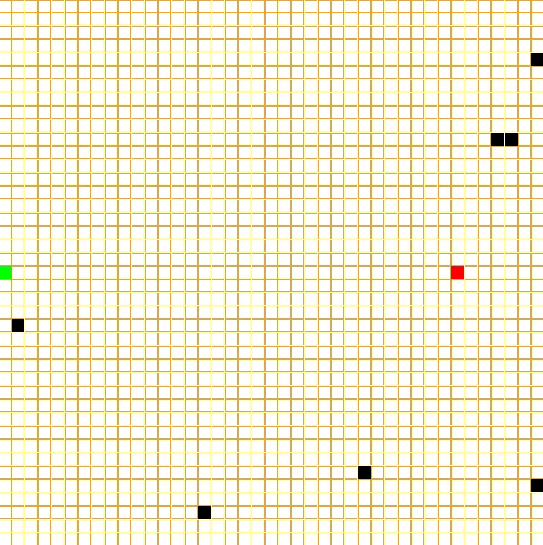

# Method of approach


## History

There are multiple parts to *PathMaker* development of *PathMaker* originally started as a simple pygame where you play tag against a computer and the goal is to avoid the computer for as long as possible. The idea for this project stemmed from this as a question on how should I handle the Pathfinding was constant because there was a dynamically changing environment so pre-computation like with a *nav-mesh* was not feesible. A-star needed to much time to complete when the computers goal was constantly changing.


The grid system implemented in the *PathMaker* is based off of this pygame. 

## User Interface


### Components

Most of the code for *PathMaker* is user interface, as this project doesn't use very many libraries or external crates to function. This implementation solely relies on SDL2 as mentioned in previous chapters. This means that things such as buttons, sliders, text boxes, dropdown menus and checkboxes all needed to be implemented manually. These were all originally separately programmed and didn't share any common traits. This made it very difficult to add new features and modify existing ones. This is where the component trait comes in. All of these items are very similar in there structure and functions they may just display differently or in the case of dropdown menu uses the standard button within it's code. All of these share a trait which in rust is a shared characteristic or function that everything with that trait must implement. This allows for *PathMaker* to iterate through a list or vector as there called in rust with items that have multiple types as while you can't have a vector or data container with multiple types such as a list of strings and integers, with traits you can have the list be dynamically typed and you can have vector of things that have the same trait. This allows the compiler to know what to expect so since everything with the component trait has a draw function with the same arguments and return type. I can iterate through that vector and call the draw function. This makes it a lot easier to track user inputs and clicks instead of having to separate a standard button from a dropdown they can all be stored with in the same container and checked iteratively since everything with component trait has an on click function. This leads into a bit higher level implementation of these items.

#### Complex Components and Interface

There are more complex interface components such as a file explorer or dropdown that may have other components stored within them and have vastly different functionality then something like a checkbox or standard button.

##### Sliders 

Sliders allow for a controlled numbered input for allowing users to control things such as the weight of specific tiles or the range of weights that program generates when generating a board. This allows for a much more controllable input then something like a text input where a user can type what the value they want. This allows *PathMaker* to put limits on what can be inputed and lowers the possibilite of errors if they aren't properly handled if an invalid or unexpected input is giving. But there are Input boxes that users can type in select circumstances.

##### Input Box

Input boxes are simply components where a user can type information into and it saves what is typed. These are mostly used in the file explorer in order to be able to jump to a location in a users computer without having to click through a ton of buttons. These work by when they are clicked_on they are considered active and it activates SDL's built in text-input subsystem allowing things to be typed. Then when a user presses enter it deactivates and depending on the purpose of that Input box act accordingly.

##### File Explorer

In order for users to be able to save and select files for use in *PathMaker* it needed to have a way to retrieve the files from computers. Usually an easy way to do this is to use a computers built in file explorer, however as most of development of *PathMaker* uses WSL or Windows Subsystem for Linux. This caused issues with opening the proper file explorer and trying to retrieve files from a part of the computer that doesn't use the same path conventions and the program not being able to properly get what operating system the computer uses. So instead *PathMaker* has it's own file explorer that walks through a users files before running and splits them into a Hashmap with each key, value pair having the path to that location and any children so files or other directories that are located within the part of the computer. At first the file explorer just displayed every single file at once and would have a dropdown for directories to get to more files. This caused major performance issues because of how many files the program would have to render at once so in order to fix this it now uses the hashmap as said before and which ever directory is currently the set display it displays the children of that key and if it's a directory it's changes the key and displays that directories children then if it's a file it attempts to retrieve the information of that file. In order to speed up loading times it only starts with the root directory of the user and then when clicking on a directory it will then get the children of the directory and adding it to the hashmap this removes the need to get every file on a users system and instead opting to only load the files explored.

### Widgets

While being able to draw and check if something is clicked on easily was solved by the component and interface traits respectively. There was another issue on how the UI is formatted and what are the size of the buttons where do they appear on the screen how to they react to the window size changing. This is where widgets come in, widgets are like a container for the interface components similar to something like a flex box or grid in HTML. These allow for easy implementation of new UI components and menus as you can set the overall size of the widget and location. Give it a vector of components and where you want them to formatted within the widget and widgets will calculate the size, location and layout of all of them allowing for things to be easily grouped together and well formatted and also allowing for a more reactive UI for different screen sizes.

Widgets also make checking which button is clicked easier. This is because widgets format things by taking how many rows and columns it needs to be formatted it in, so if I give the format information and it's two cells high and three cells wide it will divide those by the widgets height and width to know how large each cell in the widget is. It then makes a hashmap based on the location of these cells with a value of which interface component is associated or located within that cell. Since every cell is the same height and width you can calculate what is the origin location of the cell or the top left corner of it and immediately know witch component was clicked on without having to iterate through everyone and seeing the mouse location is within there specified bounds.

```rust
let rows = self.layout.len() as u32;
let cols = self.layout[0].len() as u32;
let cell_height = self.height / rows as u32;
let relative_x = mouse_state.x() - self.location.x();
let relative_y = mouse_state.y() - self.location.y();

if relative_x < 0 || relative_y < 0 {
  return result;
}

let cell_x = relative_x / cell_width as i32;
let cell_y = relative_y / cell_height as i32;

if cell_x >= cols as i32 || cell_y >= rows as i32 {
  return result;
}
let pos: (i32, i32) = (cell_x, cell_y);
```

This makes the program run a lot smoother and faster as there is no iteration required and there is now a constant amount of time it takes to find the button clicked on. So widgets make the program easier to add features and menus aswell as make *PathMaker* more efficient in how it knows which button was clicked.

### Marking Components as Dirty

As mentioned previously before the board and store a value known as dirty in order to know if a component needs to be redrawn. This is so the program doesn't waste time on drawing components that haven't changed from a previous iteration and therefore wouldn't change in appearance to the user if redrawn. SDL doesn't remove things every frame and when drawing something new it's simply drawn on top of what was previously there.
This means that if a menu pops up when the menu is exited everything behind that menu needs to be marked as dirty in order to be drawn on top have the menu actually hidden from view of the user. This causes another issue where components may sometimes overlap, so as a result you need to check if the component is active/currently usable.

```rust
fn draw<'a>(
        &self,
        canvas: &mut Canvas<Window>,
        texture_creator: &'a TextureCreator<WindowContext>,
        mouse_position: Point,
        font: &mut ttf::Font<'_, 'static>,
    ) {
        let hovering = self.mouse_over_component(mouse_position);
        if self.is_hovering() != hovering {
            self.change_drawn(false);
            self.change_hover(hovering);
        }
        if self.is_drawn() {
            return;
        }

        // Draw code here
}
```

### Checking if a component is active

Each component also has an active value which similar to dirty is either true or false. Since SDL simply draws things on top of others and doesn't actually remove things from the window. Lets say I'm on the base menu and I wan't to save file when I click save file it loads a different menu but that menu is location above the board so if the board wasn't deactivated the program would think the board was being clicked an update accordingly despite the part being clicked on not being visible to the user. So to solve this components don't react to being clicked on unless they are considered active.

```rust
fn on_click(&mut self, mouse_position: Point) -> (bool, Option<String>) {
        return (
            self.mouse_over_component(mouse_position),
            Some(self.get_id()),
        );
    }

    fn mouse_over_component(&self, mouse_position: Point) -> bool {
        let component: Rect = self.get_rect(self.location);
        return component.contains_point(mouse_position) && self.active;
    }
```

### Storing component information after first draw

In many of the component there is something that says something like `pub cached_texture: Option<Texture<'static>>` or `cached_rectangle: Option<Rect>`. Once a component is drawn it may cache some of the information computed by the draw function so it doesn't have to be computed later unless necessary so if the texture for the text displayed on a button has already been created it won't have to be computed again unless it changes or in the case of tile or gameboard storing the the rectangle that is used to draw them so it doesn't need to be computed again unless it's location or size changes. The gameboard also caches grid information as the grid is set up by the board and has to be computed leading to code that looks something like this.

```rust
fn ensure_grid(&self) {
    if self.cached_grid.borrow().is_some() {
        return;
    }
    let size: usize = (self.tile_amount_x * self.tile_amount_y) as usize;
    let mut grid = Vec::with_capacity(size);
    let tile_width = self.tile_width();
    let tile_height = self.tile_height();
    for tile in 0..size {
        let num: u8 = 1;
        grid.push(Tile::new(
            util::get_coordinate_from_idx(tile, self.tile_amount_x, self.tile_amount_y),
            TileType::Floor,
            tile_height,
            tile_width,
            num,
            true,
             WHITE,
        ));
    }
    self.cached_grid.borrow_mut().replace(grid);
}
```

### The Game Board

The main feature of *PathMaker* or at least the central visual component the gameboard functions very similarly to a widget. The game board itself is a component so it has an on_click function and the ability to change the height and width of it like every other component. It however isn't an interface trait and implements its own personal draw function and has a lot of functions specific to the game board. The game board is made up of tiles tiles are structure that track the TileType, height,width, weight and also cached tile. The board has a flat vector that stores each tile and the index of the tile corresponds to it's position on the board.T his allows the gameboard to functionally to be a manager of the tiles and similar to the Widgets every tile has the same size meaning when clicked on it uses a similar system to the widgets the point that's given is transformed into an index through the following code `let pos_idx = (tile_y * self.tile_amount_x as i32 + tile_x) as usize;`. Which will then get the corresponding Tile to the index allowing it to be changed directly. The Game board has the most amount of parts to it out of any of the components meaning it is very important to make sure it isn't being updated and iterating through the tiles unless absolutely needed. Each tile also stores a value called dirty that is either true or false, this is used to tell the program if a tile needs to be redrawn or not. So if the TileType changes or the location of the board changes the tiles would be marked as dirty and be redrawn on the next iteration of the program. While the board still needs to iterate through all the tiles to check if they need to be drawn it does save time to not have to draw every single one if not necessary. Widgets and the other interface components use a similar system where they are marked dirty if the need to be redrawn.

#### Tile Structure
```rust
pub struct Tile {
    pub position: (i32, i32),
    tile_type: TileType,
    height: u32,
    width: u32,
    pub weight: u8,
    dirty: bool,
    cached_rectangle: Option<Rect>,
    cached_color: Color,
}
```

#### Saving and Loading Game Boards

The game board can also be saved as a json file below is an example of what that file looks like although shortened as they can be a couple thousand lines long.

```json
{
  "height": 800,
  "width": 800,
  "tile_amount_x": 40,
  "tile_amount_y": 40,
  "starts": [
    [
      17,
      25
    ]
  ],
  "goals": [
    [
      18,
      6
    ]
  ],
  "multiple_agents": false,
  "multiple_goals": false,
  "tiles": [
    [
      "3,8",
      "Floor",
      "1"
    ],
  ]
}
```

In order for *PathMaker* to achieve this it uses the serde crate for rust allowing for the easy creation and parsing of json files. The gameboard implements the Serialize and Deserialize traits from serde,this allows the board information to be automatically written and formatted into a json using the functions provided by said crate and can also be read and converted into a game board structure. The file doesn't save everything else about a board can be computed during runtime and doesn't need to be known before hand.

```rust
// Reading a json file and creating a board structure from it
let result: Board = serde_json::from_str(&board_json).expect("yes");
```

```rust
// Save board information as json formatted string.
let json = serde_json::to_string_pretty(&self)?;
```

While the UI is the largest part of the program for *PathMaker* and is primarily what user's will interact with it is not the main purpose of *PathMaker*. That comes in the form of actually benchmarking the environments and algorithms created by the user. So how does *PathMaker* actually do that?

## Implementing Pathfinding Algorithms

*PathMaker* has a couple of built in pathfinding algorithms such as a modified greedy search, A* and Breadth-first-search. Greedy search is the simplest implementation and it's performance isn't affected by weight complexity but it also has the most pitfalls. 

### Finding Possible Moves

In order to ensure consistency each algorithm uses the Possible_Moves function in order to get a list of possible moves that can be reached from a position on the grid. This is necessary because since *PathMaker* allows diagonal movement if a orthogonal direction is blocked by an obstacle then corresponding diagonals are also impossible to reach from the given position. `possible_moves` uses a bitmask to determine if a move is possible it has 8 different possible directions it will check if each neighboring tile is traversable meaning it's not an obstacle. If it is has a bitmask and inserts 1 and shifts it to the left.

For example if it checks the fourth neighbor which is the left direction and the bit mask previously were all not traversable. So it would look something like *0b00000000*. It will then set it to *0b00000001* then shift the 1 three spaces over making it now equal *0b0001000*. The 1 meaning the tile is traversable. But lets say it's the same situation but the tile is an obstacle there for not traversable there is another array that stores which value's should be blocked since an orthogonal obstacle blocks more than itself. The block mask is set up as follows

```rust
const OBSTACLE_BLOCK_MASK: [u8; 8] = [
    0b0000_0001, // 0 NW: only itself
    0b0000_0111, // 1 N:  NW | N | NE
    0b0000_0100, // 2 NE: only itself
    0b0010_1001, // 3 W:  NW | W | SW
    0b1001_0100, // 4 E:  NE | E | SE
    0b0010_0000, // 5 SW: only itself
    0b1110_0000, // 6 S:  SW | S | SE
    0b1000_0000, // 7 SE: only itself
]; 
```

So once again if the fourth neighbor checked is an obstacle which corresponds to index 3 of the block mask which is West or the left direction it will return *0b0010_1001* meaning NW(top-left), W(Left) and SW(Bottom left) are all not reachable from the current point. Keep in mind the traversable and blocked values are both just a single u8 and it won't change any of the bits back to zero so it can only change them to 1 so once there set to 1 they stay that way for the next neighbor. After all the neighbors are iterated through it will compare the bits of traversable and blocked. with `let valid = traversable & !blocked;`. So if traversable = *0b0110_0101* blocked would then equal *0b1011_1111* so not blocked = *0b0100_0000, Valid in this case will equal *0b0100_000*. The logic being that the bit in valid is equal to 1 only if the bits at same location in traversable and not blocked both equal 1 which is illustrated in the following table.

Table: Mask Comparison

|Mask|SE|S|SW|E|W|NE|N|NW|
|:-|:-|:-|:-|:-|:-|:-|:-|:-|
|Traversable|0|1|1|0|0|1|0|1|
|Blocked| 0|1|0|0|0|0|0|0|
|**Valid**|**0**|**1**|**0**|**0**|**0**|**0**|**0**|**0**|

But how are the algorithms themselves implemented? I'll start with explaining Greedy search as it is the most modified from it's original and also the simplest to explain.

### Greedy Search

Greedy search is the only algorithm that doesn't take into account tile weight as greedy search is basically if something gets it's closer to it's goal then it will take that step even if that sets it back in the long run. So using something like tile weights and having it go to the tile with the smallest weight around it wouldn't try to reach the goal. So instead greedy search is purely location based so if a tile next to it is closer to the goal it will go to that one not accounting for weight the code for this is below. 

```rust
for neighbor in &neighbors {
    if (neighbor.0 - goal.0).abs() < (current.0 - goal.0).abs()
        || (neighbor.1 - goal.1).abs() < (current.1 - goal.1).abs()
        {
        good_moves.push(*neighbor);
        break;
    } else {
        bad_moves.push(*neighbor);
    }
}
```
This system works for grids with a minimal amount of obstacles a problem occurs when it runs into a situation where no move it can make gets it closer to the goal. This would result in the algorithm getting stuck and not making another move, in order to solve this if this occurs it will pick a random move and put the previous tile in a blacklist so it no longer considers that tile a possible move.

```rust
if let Some(chosen_move) = good_moves.choose(&mut rand::rng()) {
    current = *chosen_move;
    path.push(*chosen_move);
} else if let Some(chosen_move) = bad_moves.choose(&mut rand::rng()) {
    black_list.push(current);
    current = *chosen_move;
    path.push(*chosen_move);
}
```

This works to get around a majority of obstacles but as the board increasingly fills with obstacles there can be an issue where the algorithm blacklists a tile that is required to reach it's goal making it impossible and causing the algorithm to run forever. As a result greedy search can cause an infinite loop within the program if a grid has too many obstacles or it is put into a specific situations. Algorithms like A* and Breadth-First don't have such issues.

### Breadth-first-search

Breadth first search is very simple in concept but functions in a lot more situations then something like greedy search. *PathMaker*s implementation works by using a VecDeque which in rust is basically a list but it has an end on both sides. This makes it easier to get the first value in a list of items and remove it. Essentially BFS works by getting the start tile getting it's neighbors checking if there the goal and then checking the neighbors of those neighbors until it finds the goal.

```rust
let neighbors = get_possible_moves(current, map, width, height);
for neighbor in neighbors {
    if !visited.contains(&neighbor) {
        visited.insert(neighbor);
        parent.insert(neighbor, current);
        queue.push_back(neighbor);
    }
}
```
BFS is the same as greedy search in which the weight of a tile is unimportant to it as it is not designed to find the shortest but to find a path in general. It still has it's uses as a feature of BFS is that it only checks a tile once making it useful for seeing if a giving grid or path is possible, which is used extensively within *PathMaker*. Unlike BFS and Greedy search there are algorithms where finding the shortest path is the goal and are implemented in *PathMaker* such as A-star.

### A-star

A-star works by estimating the path cost of every node when searching. So at the start node it will get the manhattan distance between the start and the goal ignoring obstacles. This is stored in a BinaryHeap to function like a priority queue meaning it orders the heap by a value which in this case is the cost of a node. Which at the start is the Manhattan distance of the node. It will then get the last value in the heap and since it is ordered the last value is the lowest cost. At the start this doesn't mean much but it will then get all the neighbors of that current tile and iterate through them it will then track there weight. It will then try and estimate a g_value which for each tile is stored in a HashMap if the tile hasn't been explored yet it won't have a g-value and it will default to the maximum value allowed by a i32 integer. It will then get the g-score of the current tile which at the start is zero and the weight of the current neighbors weight to that value this is known as the tentative_g. It then checks if the tentative_g is less than the neighbors g-score which once again if the neighbor hasn't been visited yet is guaranteed to be higher. If this is true it will then set the cost of that neighbor to the tentative_g + the manhattan distance between the neighbor and the goal as seen below.

```rust
let tentative_g = g_score.get(&current).unwrap_or(&i32::MAX) + move_cost;
if tentative_g < *g_score.get(&neighbor).unwrap_or(&i32::MAX) {
    parent.insert(neighbor, current);
    g_score.insert(neighbor, tentative_g);
    let f = tentative_g + heuristic(neighbor, goal);
    open_set.push(Node {
        cost: f,
        position: neighbor,
    });
}
```
It does this for every neighbor and then it will search the neighbor with the lowest estimated cost first. It continues to repeat this until the goal is reached. This method guarantees the A-star finds the shortest path between to points every time. A-star search is a very efficient algorithm but if it is a given an impossible path it can get stuck or run forever.


### JPSW

#### Overview

JPSW operates as an A*-like search over a set of waypoints called jump points. At each visited node, we compute which directions lead to pruned successors by examining the local 3×3 neighborhood. We then "jump" along each valid direction until reaching a meaningful waypoint—either the goal, an obstacle,edge of the map, or a change in terrain or in this case weight value.

#### Successor Pruning

At each node, it's determine which of the eight possible directions (including diagonals) constitute valid successors. Rather than expanding to all traversable neighbors, we identify directions that can be eliminated via a local Dijkstra search over the 3×3 neighborhood surrounding the current position.

The 3×3 neighborhood is encoded as a hash of tile weights and traversability, which serves as a cache key. The local Dijkstra computes the shortest path from each neighbor back to the parent direction. A neighbor is retained as a successor only if its shortest path passes through the current node—meaning there exists no shorter route that bypasses it. This pruning eliminates redundant expansions in open areas.

The result is stored as an 8-bit bitmask where bit i corresponds to direction i in the movement delta array.

#### Jumping

For each valid successor direction, we compute the next jump point by traversing in that direction until one of the following conditions is met:

**Orthogonal jumps** proceed in a cardinal direction (horizontal or vertical). The jump terminates when the next cell is blocked or out of bounds, the goal is reached, the tile weight differs from the starting weight, or a perpendicular neighbor changes (indicating a forced path deviation).

**Diagonal jumps** proceed diagonally while ensuring both adjacent orthogonal cells are traversable (preventing corner-cutting violations). The jump terminates on reaching the goal, weight transition, or when an orthogonal jump from the current position would succeed—indicating a path deviation point.

#### Cost Function

Movement cost between two tiles is computed as a weighted average of their terrain costs. For orthogonal moves, cost = (weight_from + weight_to) / 2. For diagonal moves, we include the two side cells in the average and multiply by √2 to account for the longer traversal distance.

#### Search Procedure

The main search maintains a min-heap prioritized by f-score (g + heuristic). We store g-scores, parent pointers, and a closed set. At each iteration, we pop the node with lowest f-score, compute pruned successors via the neighborhood analysis, then jump in each direction to identify the next waypoint. If the new g-score improves on a previously visited position, we update its parent and push it to the heap.

The heuristic uses diagonal distance: 
$$ 
\text{diagonal distance} = d × \sqrt{2} + (\text{max(dx, dy)} - \text{d}), \text{where d} = 
\text{min(|dx|, |dy|)}
$$

#### Path Reconstruction

JPSW returns only the sequence of jump points rather than every cell in the path. To reconstruct the complete trajectory, we fill in intermediate cells between consecutive jump points by iterating with the sign of each direction component. This is not tracked when benchmarking and is run in order to display a proper visualization of the path found.

#### Caching

Two caches accelerate repeated queries. The successor cache stores pruned direction bitmasks keyed by parent direction and neighborhood hash. The orthogonal jump cache stores results keyed by position index, direction, and starting weight. Both caches must be cleared when the map changes.

## Benchmarking

The benchmarking in *PathMaker* takes inspiration from Guards a benchmarking framework designed for weighted grids and designed to help developers decide on what algorithms to use within a videogame[@MOGHADAM2024]. While *PathMaker* doesn't use actual guards as described in the paper which are essentially points on a map that effect the weight areas around which is essentially the traversal cost a higher traversal cost equaling difficult terrain or some sort of difficulty navigating. *PathMaker* does use a weighted grids,obstacles and calculates the WCF value of given maps or generated ones. WCF being the weight complexity of a grid this is calculated by taking the weight gradient of tiles or how much tiles close together weights differ from one another and calculating how complex or how difficult it would be for something like A* to navigate or find the shortest path. Weight gradient is important because having drastically different weights actually lowers complexity because if a weight is too high it functionally acts as being impassable and algorithms like A* will functionally ignore it. So having minor difference in weights actually makes it more difficult because it becomes harder to tell which path has a better chance of leading to a the shortest path. The gradient is calculated using the Sobel operation[@Sobel]. This gives tiles directly next to the tile a higher effect on it's gradient you then iterate through all usable tiles ignoring impassable ones like obstacles. You essentially add the weights of all tiles withing the current operation multiply them by there given weight values which can be -2,-2,0,1 and 2.

### WCF Value

The Sobel operation uses two different convolutions to represent vertical changes and horizontal changes you calculate both for each passable tile on the board.
$$
Gx = 
\begin{bmatrix}
-1 & 0 & +1 \\
-2 & 0 & +2 \\
-1 & 0 & +1
\end{bmatrix} * M
$$

$$
Gy = 
\begin{bmatrix}
-1 & -2 & -1 \\
0 & 0 & 0 \\
+1 & +2 & +1
\end{bmatrix} * M
$$

You can then get the total weight gradient for that tile by squaring the vertical convolution and horizontal convolution adding them together and getting the square root.

$$
G = \sqrt{G_{x}^2 + G_{y}^2} 
$$

$n = \text{Passable tiles}$
$$
C_i =  \begin{cases}
0, \text{if}\space G_i\space \text{is}\space 0
\newline
1 - 0.01 * log_2(G_i)
\end{cases}
$$
$$
WCF = \frac{\sum_i^n C_i}{t_m} 
$$

### Memory used and Time Taken

*PathMaker* also track the amount of allocated memory taken up by the algorithm being run. This is done using the jemallocator crate, this allows for *PathMaker* to track allocated memory on specific threads allowing for easier tracking and less errors as it can cause a problem if total memory is being tracked and it can equal more than the memory allocated within the current thread. Currently *PathMaker* keeps track of the amount of memory allocated in bytes but it does not track ram usage. Time is tracked by using the rust standard time library and tracking how much time passes when the pathfinding algorithm is run.

```rust
let now = Instant::now();
epoch::advance().unwrap() // Update memory statistics
let before = allocated.read().unwrap().get();
let (path, steps) = get_algorithm(algorithm).find_path(self.start, self.goal, &map);
epoch::advance().unwrap(); // Update memory statistics
let after = allocated.read().unwrap().get();
let time = now.elapsed();
```

### Steps taken

The built in algorithms count each step taking and return it when the find a path. This allows *PathMaker* to track how many steps it took for an algorithm to find a path or complete. 

### Total path cost

After the algorithm specified by the user is done computing a path that path is sent to function to take all of the moves stored within the path and getting the weights from the grid and summing them together to get the overall traversal cost of the path found.

```rust
fn get_overall_path_weight(
    path: &Vec<(i32, i32)>,
    map: &Vec<Tile>,
    width: u32,
    height: u32,
) -> u32 {
    let mut total_weight: u32 = 0;
    for moves in path {
        if let Some(tile) =
            util::get_idx_from_coordinate(*moves, width, height).and_then(|idx| map.get(idx))
        {
            total_weight += tile.weight as u32;
        }
    }
    return total_weight;
}
```

### Generating randomized boards

In order to track how WCF effect things like memory used steps taken and overall path cost there needs to be multiple grids tested. *PathMaker* has the ability to generate randomized grids with a specified weight range, amount of obstacles and amount of weighted tiles as well as the ability to run doubling experiments with said generated grids. 

**Parameters**

- **Weight Range:** Decides the range within weighted tiles can generate with max is *0 - 255* 
- **Obstacle Count:** Amount of obstacles placed on generated board
- **Weighted Tile Count:** Amount of non obstacle tiles with a weight greater than 1

These parameters are important for controlling board complexity as the goal is to have boards generated with similar parameters to have a similar weight complexity. Higher weight range on average decreases weight complexity, Obstacle count often increases weight complexity as the board functionally becomes smaller, and the amount of weighted tiles increases complexity the more there are. Board size also has a significant impact on weight complexity with smaller boards being a lot more sensitive to changes in weights and larger boards if not weighted having a naturally lower wcf value.


The game board does not generate random locations for the start and goals though are decided by the user, so a user specifies where the start and goals are and the *PathMaker* will generate different grids with those in mind. There is a problem with generating randomized grids depending on the amount of obstacles specified to be on the board and especially with doubling experiments it may become impossible to find a valid path to a goal which can cause an infinite loop for algorithms if not caught. The estimated weight complexity for 40x40, 100x100,500x500 with all tiles having a weight of 1 is listed below.

**40 x 40 (WCF):**  0.1056
**100 x 100 (WCF):**  0.0404
**500 x 500 (WCF):**  0.00789

#### Avoiding Impossible Game Boards

In order to get around this, there was really only one option for each start and goal pair specified on the board *PathMaker* will run a breadth first search without tracking any of the benchmarks and if the number of steps ever equals or goes above the amount of passable nodes it considers it impossible to find a path. This works because breadth first search will search every possible tile until a path is found and will only check a tile once, so if the amount of steps ever equals the amount of passable tiles and nothings has been found then it's safe to assume there is no possible path to be found. There are other equations that can calculate every single possible path within a grid but these are computationally expensive and would be preferred if the board wasn't expected to change immediately afterwords so for a constantly changing board it would be inefficient to do this. But if an impossible board is given the program will generate another one until it is possible for all agents on the board to find there to there specified goal.

There has also been a limit placed on doubling experiments because at some point it will become impossible or extraordinarily unlikely. So the amount of obstacles able to be on a board is currently capped by the equation below
$$
\text{Max number of Obstacles} = \frac{\text{Number of Tiles}}{2 * \text{Number of Agents}}
$$

Another way to do this would be to just make sure the minimum number of tiles to reach the goal is always present, the problem with this is that it still runs into the problem of being extremely unlikely to find a possible board and even if a possible board is found, the resulting board wouldn't be representative of real life and wouldn't make algorithms make any decisions as the only tiles they can move to will always be the correct one.
